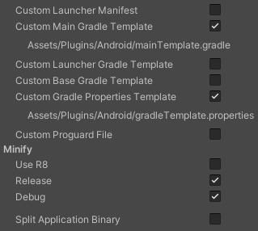

# Signalboy Plugin for Unity
Tested with Unity Version: 2021.3.9f1

## Documentation
* [Quick Start Example](#quick-start-example)
* [Dependencies](#dependencies)
* [Prerequisites](#prerequisites)
* [Installation](#installation)
* [Advanced usage](#advanced-usage)
* [Upgrading the companion Android library](#upgrading-the-companion-android-library)

## Quick Start Example
* Place `Signalboy.prefab` from "Default Runtime"-sample into your Scene.
* Interact with Signalboy-service by interfacing with the GameObject named "Signalboy" from your code:
```cs
using System;
using System.Collections.Generic;
using System.Threading.Tasks;
using Signalboy;
using Signalboy.Utilities;
using Signalboy.Wrappers;
using UnityEngine;

class MyBehaviour : MonoBehaviour
{
	private SignalboyBehaviour _signalboyBehaviour;

	// Task Factory setup with Unity's Main-thread.
	private TaskFactory _uiThreadTaskFactory;

	void Start()
	{
		_uiThreadTaskFactory = new TaskFactory(TaskScheduler.FromCurrentSynchronizationContext());

		// Make sure to place the "Signalboy.prefab" into your Scene.
		var signalboyGameObject = GameObject.Find("Signalboy");
		_signalboyBehaviour = signalboyGameObject.GetComponent<SignalboyBehaviour>();

		// Run async-task on Unity's Main-thread:
		_uiThreadTaskFactory.StartNew(async () =>
		{
			try
			{
				var isSuccess = await AndroidSignalboyPermissionsHelper.RequestRuntimePermissionsAsync();
				if (!isSuccess) Debug.LogWarning("User did not grant all required permissions!");

				var result = _signalboyBehaviour.VerifyPrerequisites();
				if (result.UnmetPrerequisites.Count > 0)
				{
					HandleUnmetPrerequisites(result.UnmetPrerequisites);
					return;
				}

				var config = SignalboyService.Configuration.Default;
				_signalboyBehaviour.BindService(config);
			}
			catch (Exception exception)
			{
				Debug.LogError($"Caught exception: {exception}", this);
			}
		});
	}

	public void OnButtonClicked()
	{
		_signalboyBehaviour.SendEvent();
	}

	// Call this when it's an appropriate time to interrupt the user-journey with
	// some UI-dialogs, that Signalboy may trigger to resolve setup steps, which require user-input.
	public void TryResolveUserInteractionRequest()
	{
		// Run async-task on Unity's Main-thread:
		_uiThreadTaskFactory.StartNew(async () =>
		{
			// Check whether Signalboy is stuck during setup due to an an open User-Interaction-Request.
			if (_signalboyBehaviour.HasAnyOpenUserInteractionRequest)
				try
				{
					// Calling this may trigger the UI-Dialogs, when necessary. E.g. when Signalboy needs to perform
					// the selection of a Companion Device (Android/Companion Device Manager API) with the user.
					await _signalboyBehaviour.ResolveUserInteractionRequestAsync();
				}
				catch (Exception exception)
				{
					Debug.LogError(
						"Failed to resolve Signalboy-issued User-Interaction-Request, due to exception:" +
						exception,
						this
					);
				}
		});
	}

	private void HandleUnmetPrerequisites(List<SignalboyService.Prerequisite> prerequisites)
	{
		prerequisites.ForEach(prerequisite =>
		{
			switch (prerequisite)
			{
				case SignalboyService.Prerequisite.BluetoothEnabledPrerequisite aPrerequisite:
					// Bluetooth should be always on on Oculus.
					Debug.LogWarning("HandleUnmetPrerequisite: prerequisite=BluetoothEnabledPrerequisite",
						this);
					break;
				case SignalboyService.Prerequisite.RuntimePermissionsPrerequisite aPrerequisite:
					Debug.LogWarning(
						"HandleUnmetPrerequisite: prerequisite=RuntimePermissionsPrerequisite(" +
						$"RuntimePermissions={string.Join(",", aPrerequisite.RuntimePermissions)})",
						this
					);
					break;
				case SignalboyService.Prerequisite.UsesFeatureDeclarationsPrerequisite aPrerequisite:
					Debug.LogWarning(
						"HandleUnmetPrerequisite: prerequisite=UsesFeatureDeclarationsPrerequisite(" +
						$"UsesFeatures={string.Join(",", aPrerequisite.UsesFeatures)})",
						this
					);
					break;
				default:
					throw new ArgumentException($"Unknown case: prerequisite={prerequisites}");
			}
		});
	}
}
```

## Dependencies
* [Signalboy Android library](https://github.com/kshrana/signalboy-android) (`de.kishorrana.signalboy_android`)

## Installation
### Prerequisites (skip if already installed)
#### EDM4U
The [companion Android library](https://github.com/kshrana/signalboy-android) is distributed as a Maven package. To install it (and its dependencies) you will need to install the [External Dependency Manager for Unity (EDM4U)](https://github.com/googlesamples/unity-jar-resolver) (formerly Play Services Resolver / Jar Resolver) into your Unity-project.

Perform the following steps to setup EDM4U:
* Make sure that EDM4U is installed in your Unity-project. ([Download latest release here (.unitypackage)](https://github.com/googlesamples/unity-jar-resolver/raw/master/external-dependency-manager-latest.unitypackage))
* Currently you'll additionally have to provide EDM4U with the latest release of the companion Android library using a **local Maven repo** in your project's Assets:
  * Download the latest Maven repo[^signalboy-android-releases] and extract it to into your Unity Project root at: `<your-unity-project>/Assets/Signalboy/Editor/GeneratedLocalRepo/` (creating the filepath, if necessary)
  * (_optional, but **strongly recommended**:_) Enable custom Gradle-Template and -Properties for Android Player. See [FR Improve Android Resolver resolution and logging when conflicts occur without mainTemplate.gradle · Issue #444 · googlesamples/unity-jar-resolver · GitHub](https://github.com/googlesamples/unity-jar-resolver/issues/444#issuecomment-884549348).
    * navigating to the Android Player's settings (_Edit -> Project Settings… -> Player -> Android-tab -> Publishing Settings_) and ticking on the following two checkboxes (s. image below for reference):
    * "Custom Main Gradle Template"
	* "Custom Gradle Properties Template"  
	
  * (_optional: when EDM4U's Auto-Resolution is turned off or failed_) In the Unity Editor with your project open, select _Assets -> External Dependency Manager -> Android Resolver -> Force Resolve_

#### Setup Android SDK Tools (>= 32)
The Android companion library (*signalboy-android*) requires your Unity project to be built with **Android SDK Tools >= 33**!

* Download latest *Android SDK Tools* (**at least v32**) (easiest via *Android Studio*, s. [Android developer docs](https://developer.android.com/studio/releases/platform-tools#downloads))
* Use downloaded *Android SDK Tools* in *Unity Editor*:
  * With your project opened in the *Unity Editor*: Open the application's preferences ("*File*" -> "*Preferences...*") and browse to *External Tools*
  * Uncheck "*Android SDK Tools Installed with Unity (recommended)*" and specify your custom SDK location (default: `/Users/<username>/Library/Android/sdk`)

### Install package via GIT URL
Install latest release of this plugin using _Unity's Package Manager_:
* Either: Select _Window -> Package Manager_ and click the _"+"-Button -> Add package from git URL..._ and enter `https://github.com/kshrana/signalboy-unity.git#main`
* …or: add this plugin as a package by modifying your `manifest.json` file found at `<your-unity-project>/Packages/manifest.json` to include it as a dependency. Merge the snippet below with your `manifest.json` file to reference it.
```
{
	"dependencies": {
		...
		"de.kishorrana.signalboy_unity" : "https://github.com/kshrana/signalboy-unity.git#main",
		...
	}
}
```

## Advanced usage
### Override default configuration
Specifiy your custom `SignalboyFacade.Configuration` when binding to the Android-Service using `SignalboyBehaviour`. See the example below on how to pass it to the Android helper-library's service:
```cs
// […]
class MyBehaviour: MonoBehaviour
{
	private SignalboyBehaviour _signalboyBehaviour;

	void Start()
	{
		// […]
		var config = Signalboy.Wrappers.SignalboyFacadeWrapper.Configuration.Default;
		config.NormalizationDelay = 100L;   // in ms
		_signalboyBehaviour.BindService(config);
	}
}
```

### Check connection-state
`SignalboyBehaviour`'s `state`-property returns the current state of the service, or `null` if the service is not bound.

#### Observe
You can also monitor Signalboy-Service's state by setting a delegate on SignalboyBehaviour's `ConnectionStateUpdateCallback`-property. See the example below on how to install the delegate:
```cs
// […]
class MyBehaviour: MonoBehaviour
{
	private SignalboyBehaviour _signalboyBehaviour;

	private void SetupSignalboyDelegate()
	{
		_signalboyBehaviour.ConnectionStateUpdateCallback = OnConnectionStateUpdate;
	}

	// This method will be called on state-updates.
	private void OnConnectionStateUpdate(Signalboy.Wrappers.State connectionState)
	{
		switch (connectionState)
		{
			case Signalboy.Wrappers.State.StateDisconnected state:
				Debug.Log($"Disconnected (cause={state.cause})");
				break;
			case Signalboy.Wrappers.State.StateConnecting state:
				Debug.Log("Connecting");
				break;
			case Signalboy.Wrappers.State.StateConnected state:
				var (hardwareRevision, softwareRevision) = state.DeviceInformation;
				Debug.Log($"Connected (hardwareRevision={hardwareRevision}, softwareRevision={softwareRevision})");
				break;
			default:
				throw new ArgumentException($"Unknown case: {connectionState}");
		}
	}
}
```

## Upgrading the companion Android library
To update the [companion Android library](https://github.com/kshrana/signalboy-android) used by this plugin, perform the following steps:
* Bump `de.kishorrana.signalboy_android`'s version requirement in [SignalboyDependencies.xml](./Editor/SignalboyDependencies.xml).
* Users of this Unity Package will have to manually re-download the latest Maven repo[^signalboy-android-releases] and extract it to an adequate location (s. [Installation](#installation)).

[^signalboy-android-releases]: Find the Android companion library's latest Maven repo here: [GitHub | kshrana/signalboy-android | Releases](https://github.com/kshrana/signalboy-android/releases/latest))
